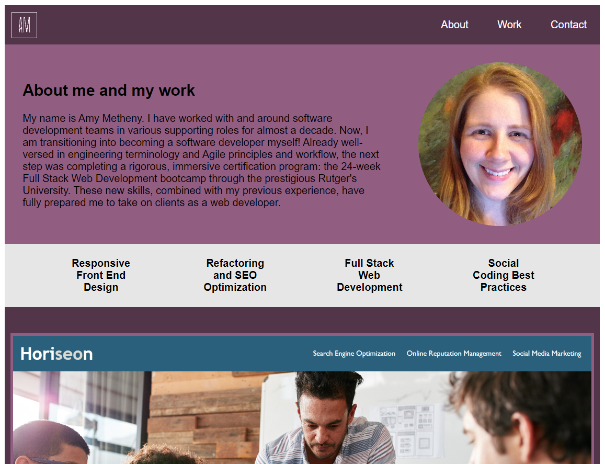
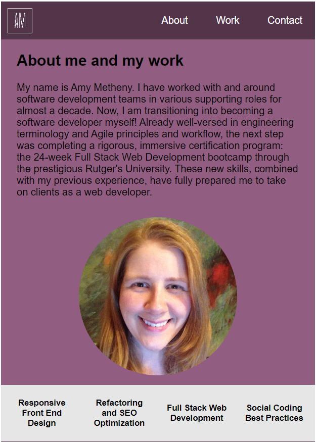
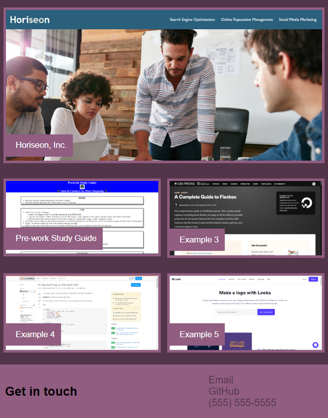

# challenge-2-professional-portfolio
Repository containing a professional portfolio to practice Rutger's Coding Bootcamp Module 2 HTML and CSS skills as well as showcase completed work. 

## User Story
AS AN employer  
I WANT to view a potential employee's deployed portfolio of work samples  
SO THAT I can review samples of their work and assess whether they're a good candidate for an open position  

## Acceptance Criteria
GIVEN I need to sample a potential employee's previous work  
WHEN I load their portfolio  
THEN I am presented with the developer's name, a recent photo or avatar, and links to sections about them, their work, and how to contact them  
WHEN I click one of the links in the navigation  
THEN the UI scrolls to the corresponding section  
WHEN I click on the link to the section about their work  
THEN the UI scrolls to a section with titled images of the developer's applications  
WHEN I am presented with the developer's first application  
THEN that application's image should be larger in size than the others  
WHEN I click on the images of the applications  
THEN I am taken to that deployed application  
WHEN I resize the page or view the site on various screens and devices  
THEN I am presented with a responsive layout that adapts to my viewport

## Description of Work Performed

Generated HTML and CSS code that accomplished the following:
* Built responsive HTML and CSS code from scratch
* Created About Me, Previous Work, and Contact sections
  * About Me section includes name, photo, and summary of experience
  * Below the About Me section is a list of my current skills and proficiencies
  * Previous Work section includes images, titles, and working links to two completed projects and placeholders for future projects; the first example appears larger on its own line
  * Contact section includes a link to my GitHub repository page as well as clickable email and phone links
* Created Nav bar that links to different areas within the HTML
* Rewrote CSS styles for several media queries down to 320px

## Link to deployed GitHub page
[Deployed Challenge 2 Professional Portfolio Repo](https://abmetheny.github.io/challenge-2-professional-portfolio/)

## Screenshots

## License

This project is licensed under the MIT License - see the LICENSE.md file for details.